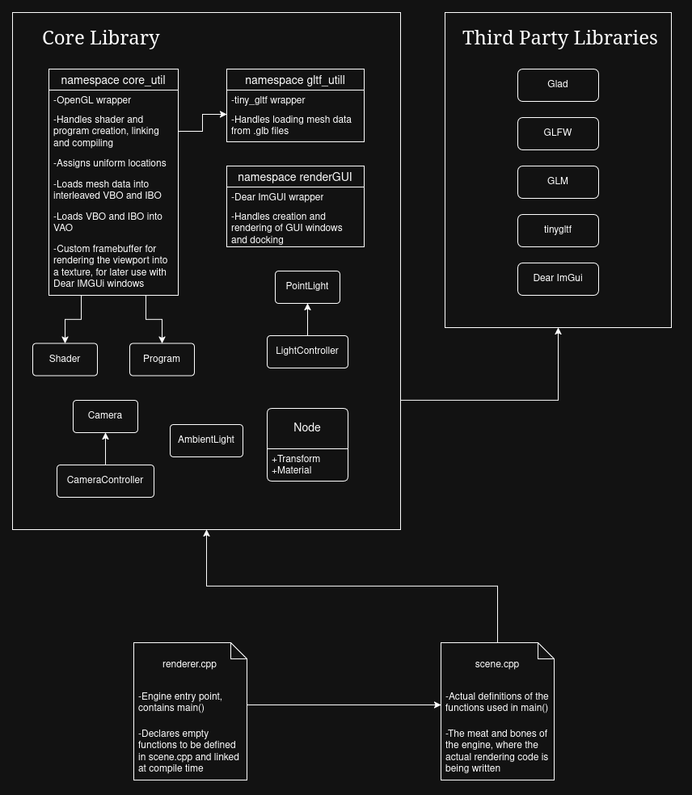

# YAGE
YAGE is (Y)et (A)nother (G)raphics (E)ngine written in C++ using OpenGL.

glfw dependencies for Fedora:
```bash
sudo dnf install wayland-devel wayland-protocols-devel
sudo dnf install libxkbcommon-devel libxkbcommon-x11-devel
```

CMAKE with clangd support:
```bash
mkdir build
cd build
cmake ..
cd ..
ln -s build/compile_commands.json .
```




